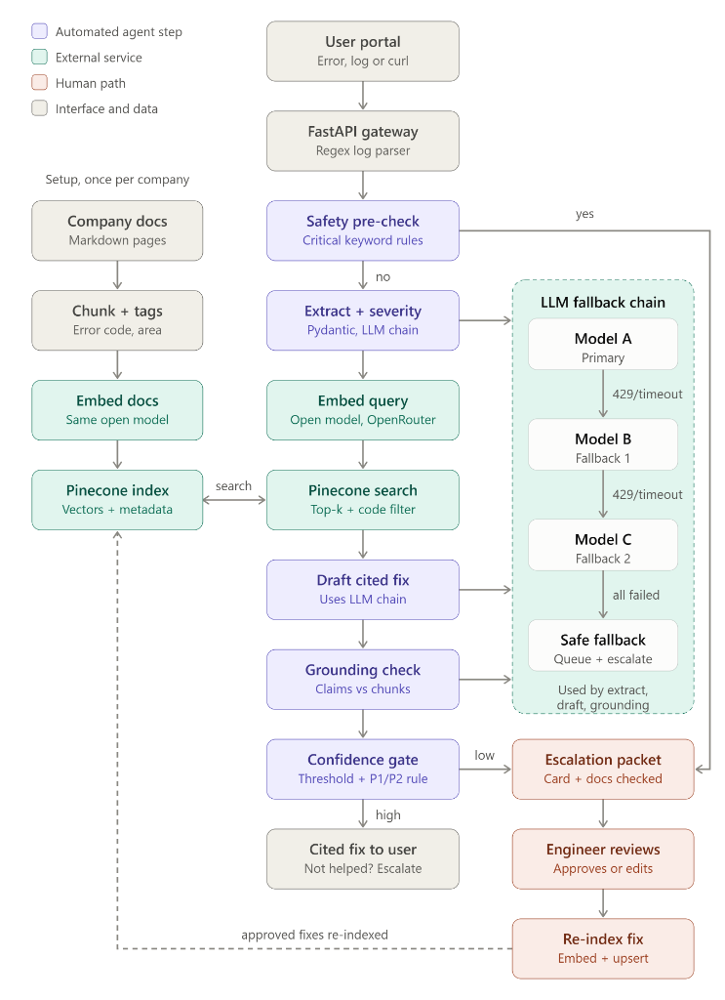
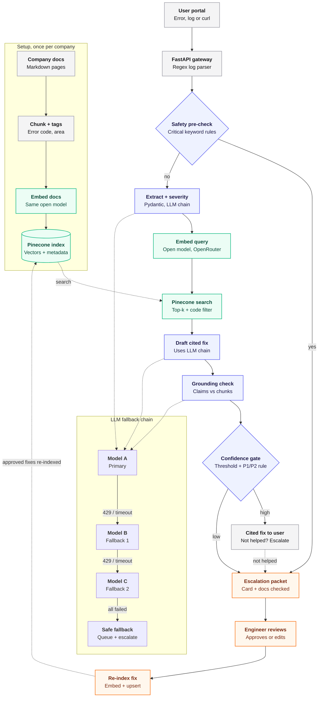

# 🛡️ DevTriage Agent
**Autonomous, Confidence-Gated API Incident & Developer Triage Copilot**

DevTriage Agent is an enterprise-grade incident copilot built for backend engineers and Developer Experience (DevEx) teams. When developers encounter cryptic stack traces, 4xx/5xx API responses, or webhook delivery failures, DevTriage diagnoses the issue against authoritative documentation with deterministic safety gating and an active learning feedback loop.

---

## 🌟 Key Features

1. **Deterministic Safety Pre-Check:** Automatically suppresses automated LLM generation for P1 outages, credential exposures, or high-risk billing failures, preventing hallucinations on high-stakes incidents.
2. **Pydantic Entity Extraction:** Parses unstructured stack traces into normalized schemas (service, HTTP status, severity, error code).
3. **Hybrid Retrieval (Pinecone + BM25):** Dense vector search paired with exact keyword and error-code metadata filtering.
4. **LLM Fallback Chain:** Circuit-breaker resilience (Primary: Llama-3.3-70B $\to$ Fallback 1: Qwen-2.5-Coder $\to$ Safe Escalation) to handle provider 429 rate limits or timeouts.
5. **Anti-Hallucination Grounding Check:** Traces every claim in the proposed resolution to indexed documentation chunks.
6. **Confidence Gating & Human-in-the-Loop Flywheel:** Issues scoring below threshold ($\ge 0.70$) route to an On-Call Engineer queue. Approved resolutions are re-indexed back into the knowledge base.

---

## 🏗️ Architecture Diagram





---

## 🚀 Quickstart & Local Execution

### 1. Clone Repository
```bash
git clone https://github.com/Jawad-Emre/DevTriage-Agent.git
cd DevTriage-Agent
```

### 2. Install Dependencies
```bash
python -m venv .venv
.\.venv\Scripts\activate
pip install -r requirements.txt
```

### 3. Launch App
```bash
streamlit run app.py
```

---

## 🔑 Demo Access Credentials
* **Email:** `demo@company.com`
* **Password:** `triage2026`
*(Or click the 1-Click Instant Demo Login button on the landing screen)*
